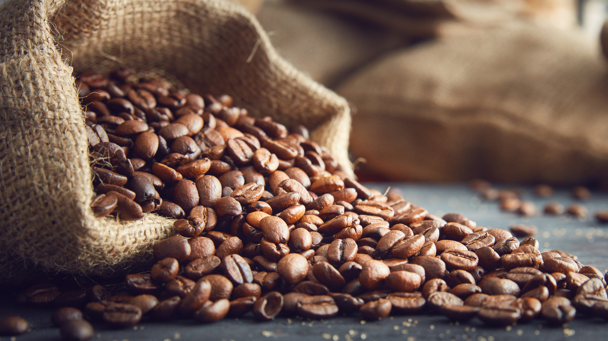

> In this report, we are going to explore a coffee dataset with the variables: Country, Region, Altitude, Year, Bean Color, Bags Produced, and Ratings. The variables were collected from the Coffee Quality Institute's review pages in 2018. The data contains reviews of the coffee beans from trained reviewers at the Coffee Quality Institute. My chosen outcome variable is the rating from 0-100 each bean got. I will analyze process method, altitude, and year as I test each to determine if they have a direct relationship with the ratings. 

```{r setup, include=FALSE}
knitr::opts_chunk$set(echo = TRUE)
```

```{r echo = FALSE}

```
Maxwell, T. (2023, June 16). Coffee. The Best Type of Coffee Beans to Use for Pour-Overs  Read More: https://www.tastingtable.com/1316018/best-type-coffee-beans-pour-overs/.
```{r echo = FALSE}
coffee <- read.csv('Project1_coffee.csv')
```
# Distribution of Ratings

```{r echo = FALSE}
library(ggplot2)
coffee_ggplot <- ggplot(coffee)
coffee_ggplot + geom_histogram(aes(x=Rating), col='black',fill='pink', bins = 5) + labs(title='Ratings of Coffee', x='Coffee Ratings',y='Frequency') + theme_classic()
```
 
This graph describes the frequency of coffee ratings. It is skewed to the left with a median rating of `r median(coffee$Rating)`. The first quartile is `r quantile(coffee$Rating, .25)` and the third quartile is `r quantile(coffee$Rating, .75)`.

# Relationship with Process Method

```{r echo= FALSE}
ND <- coffee[coffee$ProcessingMethod=='Natural / Dry', ]
WW <- coffee[coffee$ProcessingMethod=='Washed / Wet', ]
coffee_ggplot <- ggplot(coffee)

ggplot(coffee, aes(x= ProcessingMethod, y=Rating)) + geom_boxplot() + labs(x = 'Processing Method', y= 'Ratings', title = 'Coffee Ratings by Processing Method') + theme_classic()

```

```{r echo=FALSE, results= 'hide'}
aggregate(Rating~ProcessingMethod, data=coffee, mean)
aggregate(Rating~ProcessingMethod, data=coffee, sd)
```
Both distributions are skewed to the left. Natural/dry beans have a mean of 82.92516 and Washed/wet beans have a mean of 82.01479. Natural beans have a median of `r median(ND$Rating)`, and washed beans have a median of `r median(WW$Rating)`. Natural/dry beans have a first quartile of `r quantile(ND$Rating, .25)` and a third quartile of `r quantile(ND$Rating, .75)`. Washed/wet beans have a first quartile of `r quantile(WW$Rating, .25)` and a third quartile of `r quantile(WW$Rating, .75)`. The Natural/Dry beans have a standard deviation of 2.552341, and the Washed/Wet beans have a standard deviation of 2.723277. Since the means and medians of both distributions are very close we can conclude that the public doesn't favor one method over the other.


# Relationship with Altitude

```{r echo = FALSE}
coffee_ggplot <- ggplot(coffee)
coffee_ggplot + geom_point(aes(x=Altitude,y=Rating)) + labs(title='Relationship between Altitude and Ratings of Coffee',x='Altitude',y='Ratings') + theme_classic()
```

The correlation coefficient of this relationship is `r cor(coffee$Altitude, coffee$Rating)` meaning there is no direct correlation between the altitude the coffee beans were produced and their ratings.

# Relationship with Year produced

```{r echo=FALSE}
coffee_ggplot <- ggplot(coffee)
coffee_ggplot + geom_point(aes(x=Year,y=Rating)) + labs(title='Relationship Between Year Produced and Ratings of Coffee',x='Year Made',y='Ratings') + theme_classic()
```

The correlation coefficient of this relationship is `r cor(coffee$Year, coffee$Rating)` meaning that there is no correlation between the year the coffee was produced and how it was rated professionally.

## Conclusion

During this report we learned that the average rating for different types of coffee was 82.5. We have been able to test if certain variables are associated with coffee ratings. When testing the processing method we discovered that the professional raters did not prefer Washed over Natural or vice versa. Although natural beans had a higher average rating with 82.925, washed beans had a close rating of 82.015. Secondly,  we tested if altitude had a significant measure on how high the beans were rated, but from our correlation coefficient of 0.173 we could conclude that there is no relationship. Lastly, we tested if the year affects how raters rate the beans, but with a correlation coefficient of .092 it has an even weaker relationship than the altitude, concluding there is also no relationship. To enhance this data set, future researchers could collect more variables that could have a stronger affect on ratings. These could include scent, texture, and what type of coffee it is best made for. 

### References

Donald, Sam. “Coffee Csv File.” CORGIS Datasets Project, corgis-edu.github.io/corgis/csv/coffee/. 
LeDoux, James. “JLDBC/Coffee-Quality-Database: Building The Coffee Quality Institute Database.” GitHub, github.com/jldbc/coffee-quality-database. 
